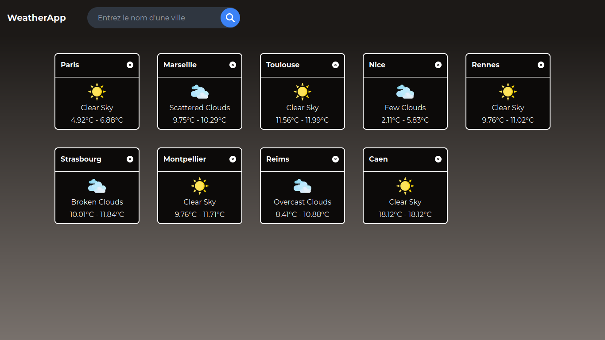

# La Capsule, projet n°6 : Backend Nest.js

Premier projet du genre, il prend la forme d'un monorepo combinant un front **Next.js**, un middleware **tRPC**, et un back **Nest.js**.

Il utilise [next/font](https://nextjs.org/docs/basic-features/font-optimization) pour automatiquement optimiser et charger la police **Montserrat**, une police de Google Font.

Objectif: Recréer l'application "Weather App" du bootcamp, se basant sur l'API d'[OpenWeatherMap](https://openweathermap.org/) pour afficher les températures des villes sélectionnées.
## Authors

- [@Mar-Nb](https://www.github.com/Mar-Nb)

## Screenshots

## Technologies utilisées

**Client:** Next.js 14, Typescript, [Panda CSS](https://panda-css.com/)

**Middleware:** tRPC

**Serveur:** Nest.js, Typescript, Mongoose

**Base de données**: MongoDB

**Outil(s) externe(s):** OpenWeatherMap API

**Bibliothèque(s)**: React Toastify

## Fonctionnalités

- Recherche de ville dans l'API d'OpenWeatherMap
- Affichage de la ville recherchée
- Suppression d'une ville dans la liste
